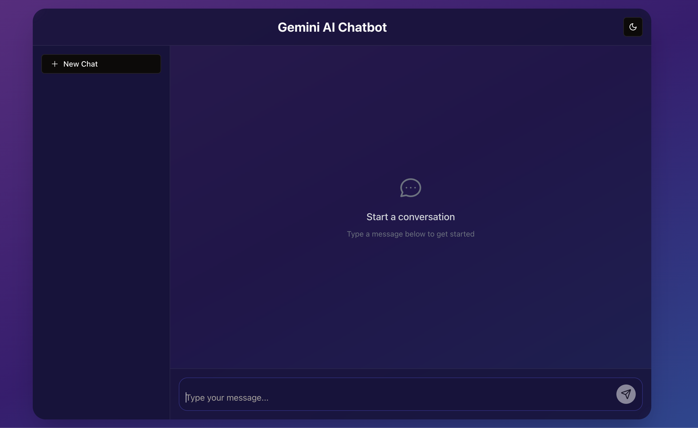

# Gemini AI Chatbot

A modern, responsive chatbot interface built with Next.js 14 and Google's Gemini AI. Features real-time streaming responses, dark/light mode, and persistent chat history.



## Features

- 💬 Real-time chat interface with streaming responses
- 🌓 Dark/Light mode toggle
- 📱 Fully responsive design
- 💾 Persistent chat history
- 📋 Message copy functionality
- 🎨 Modern UI with Shadcn components
- ⚡ Built with Next.js 14 (App Router)
- 🎯 TypeScript support
- 🎨 Tailwind CSS for styling

## Prerequisites

- Node.js 18+ 
- npm or yarn
- Google Gemini API key

## Getting Started

1. Clone the repository:

```bash
git clone https://github.com/hemaljoshi/gemini-ai-chatbot.git
cd gemini-ai-chatbot
```

2. Install dependencies:

```bash
npm install
# or
yarn install
```

3. Create a `.env.local` file in the root directory with the following variables:

```env
# Google Gemini API Key (Required)
# Get your API key from https://makersuite.google.com/app/apikey
GOOGLE_API_KEY=your_api_key_here

# Optional: Specify a different Gemini model
# Default is "gemini-2.0-flash"
GEMINI_MODEL_NAME=gemini-2.0-flash
```

4. Start the development server:

```bash
npm run dev
# or
yarn dev
```

5. Open [http://localhost:3000](http://localhost:3000) in your browser.

## Environment Variables

| Variable | Description | Required | Default |
|----------|-------------|----------|---------|
| `GOOGLE_API_KEY` | Your Google Gemini API key | Yes | - |
| `GEMINI_MODEL_NAME` | The Gemini model to use | No | gemini-2.0-flash |

## Tech Stack

- [Next.js 14](https://nextjs.org/) - React framework
- [@google/generative-ai](https://www.npmjs.com/package/@google/generative-ai) - Google Gemini AI SDK
- [Shadcn UI](https://ui.shadcn.com/) - UI components
- [Tailwind CSS](https://tailwindcss.com/) - Styling
- [TypeScript](https://www.typescriptlang.org/) - Type safety

## Project Structure

```
├── app/
│   ├── api/
│   │   └── chat/
│   │       └── route.ts    # API route for chat
│   ├── layout.tsx         # Root layout
│   └── page.tsx           # Home page
├── components/
│   ├── chat-interface.tsx # Main chat component
│   └── ui/               # UI components
├── hooks/
│   ├── use-chat-history.ts # Chat history management
│   └── use-toast.ts       # Toast notifications
└── lib/
    └── types.ts          # TypeScript types
```

## Acknowledgments

- [Google Gemini AI](https://ai.google.dev/) for the AI capabilities
- [Shadcn UI](https://ui.shadcn.com/) for the beautiful components
- [Next.js](https://nextjs.org/) for the amazing framework
